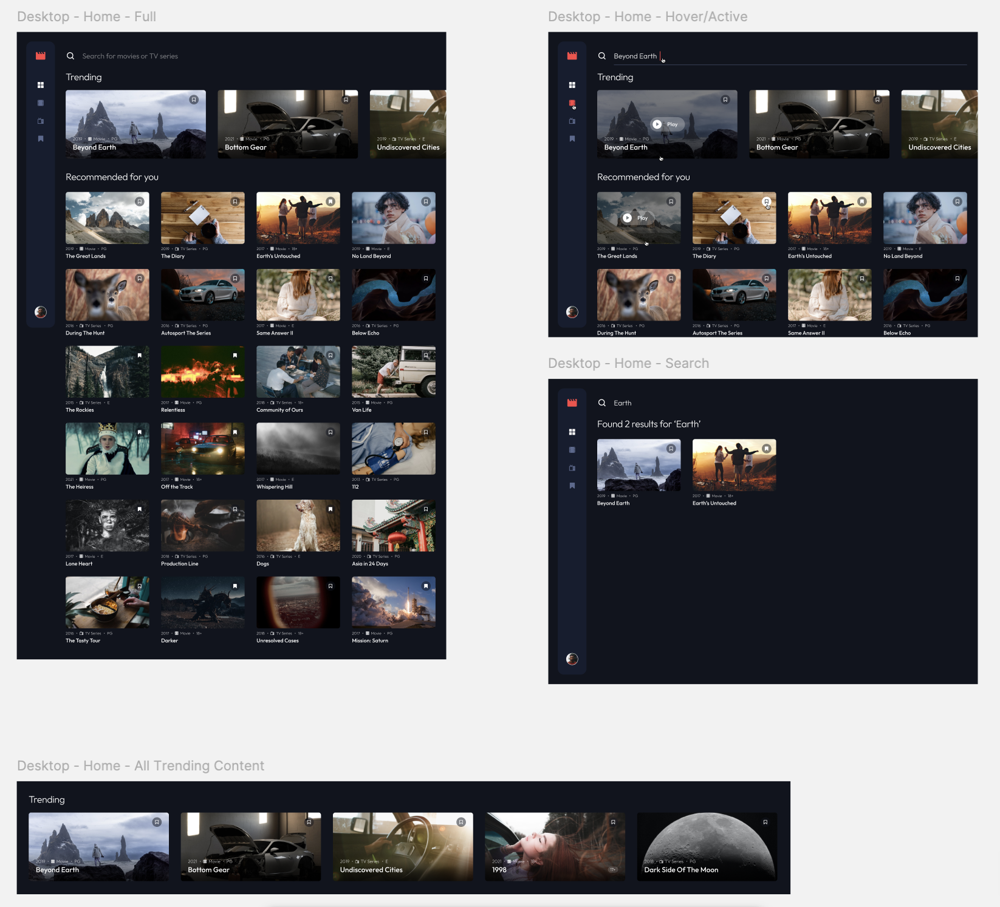
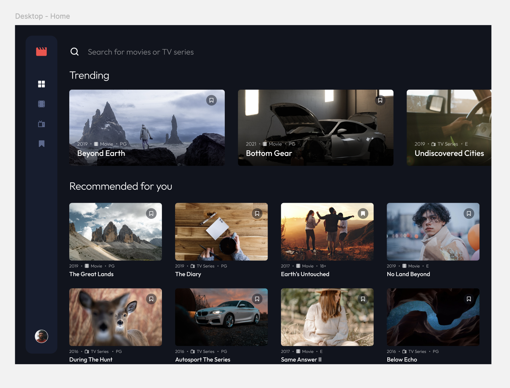
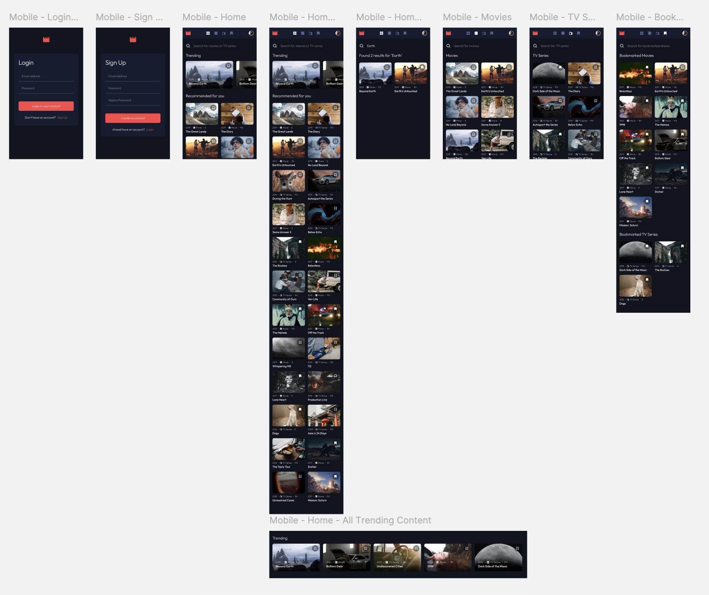

# Entertainment web app solution

This is Team Boulders, working on the Grammerhub Entertainment Web App! The team consists of:

* Developers Aurelie & Karla
* Project Manager Javier

## Table of contents

- [Overview](#overview)
  - [The challenge](#the-challenge)
  - [Screenshot](#screenshot)
  - [Links](#links)
- [Our process](#our-process)
  - [Built with](#built-with)
  - [What we learned](#what-i-learned)
  - [Continued development](#continued-development)
  - [Useful resources](#useful-resources)
- [Creators](#creator)
- [Acknowledgments](#acknowledgments)

## Overview

### The challenge

The plan is to create a fully-functional Netflix mock-up based on a provided Figma file. The Figma file depicts mockups for desktop, tablet, and mobile view.

)

Per the challenge guidelines:

> Users should be able to:
>
> - View the optimal layout for the app depending on their device's screen size
> - See hover states for all interactive elements on the page
> - Navigate between Home, Movies, TV Series, and Bookmarked Shows pages
> - Add/Remove bookmarks from all movies and TV series
> - Search for relevant shows on all pages
> - **Bonus**: Build this project as a full-stack application
> - **Bonus**: If you're building a full-stack app, we provide authentication screen (sign-up/login) designs if you'd like to create an auth flow

### Screenshots

As the frontend came together, we established a UI that closely resembled the Figma files.

### Links

The Netlify link will be posted here upon completion.

## Our process

### Built with

- [Next.js](https://nextjs.org/) - React framework
- MySQL
- Tailwind

There is consideration at the moment regarding converting the code from Next.js to React, but as of yet this has not been pursued.

### What I learned

Our favorite moments of learning will be documented in this section by the app's completion.

### Continued development

The current deadline is set to 12/23/24. If there are more features that we feel we would want to have added on, given more time, we will write them here.

### Useful resources

- [Git basics](https://youtu.be/9gJtMH7vBe8) - A general guide on how to use Git for total beginners.
- [Setting Up the Knex file](https://www.youtube.com/watch?v=5iqv41-w39c) - This provided a stronger understanding of what was already accomplished before the current Team Boulders took over the code.
- [Relational Databases](https://youtu.be/fXndSzAL1Nc?si=EIIShizneqRGV6Kd) - A primer on how relational DBs work.

## Creators

The portfolio & webpages of Aurelie, Karla, and Javier may be posted here.

## Acknowledgments

Thank you Olivia, Allan, and the entirety of Grammerhub for all your support. Any further acknowledgements and shoutouts may appear here.

**Powered by [Grammerhub](http://discord.grammerhub.org)**

